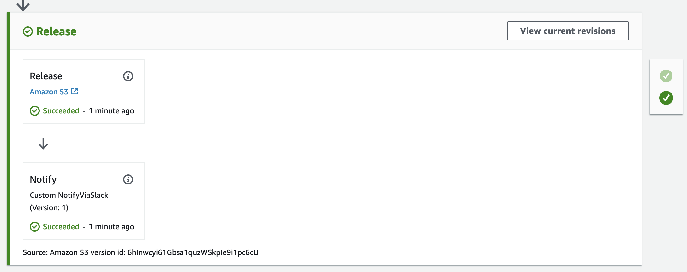

# Lambda-based CodePipeline Custom Action Provider

> Avoid long running worker instances for custom actions

## Installation

Click the above link to deploy the stack which is required to deploy the CodePipeline custom action provider. This action provider is a sample which posts a Slack message to a webhook URL, which you will need to provide.

If you prefer, you can also manually upsert the [custom_provider.yaml](custom_provider.yaml) stack from source, which you can also modify to perform a different action. The sections of the Lambda source that you should change have been highlighted for you.

## Usage

Once the custom action provider stack is created, you may immediately use the custom provider in your existing pipelines. If you do not have an existing pipeline to use, here is an example pipeline which performs a simple copy of a file/folder within an S3 bucket (which must exist prior to stack creation):

## Architecture

